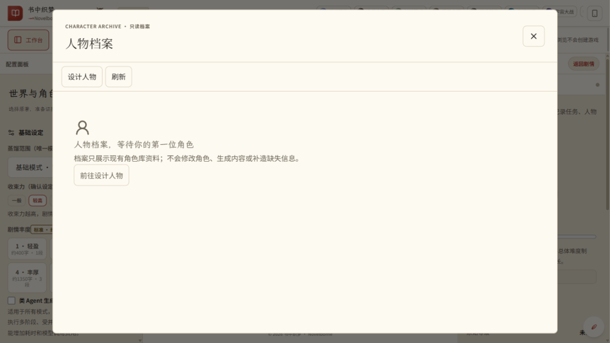
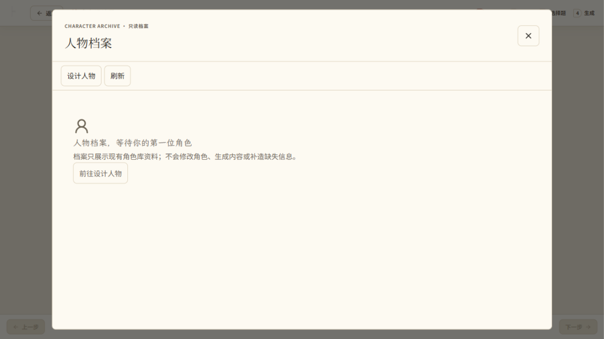

# 书中织梦（Novelborne）用户手册

> 适用版本：v3.0.0（2026 年 9 月）。本手册全部界面截图均来自合成演示数据环境，不含任何真实作品内容；涉及付费模型服务的流程，以用户使用自备凭据的实际联调结果为准。

## 目录

1. [产品概述](#1-产品概述)
2. [运行环境与安装](#2-运行环境与安装)
3. [快速上手](#3-快速上手)
4. [我的书库](#4-我的书库)
5. [全书准备（蒸馏）](#5-全书准备蒸馏)
6. [人物档案与角色库](#6-人物档案与角色库)
7. [角色设计器](#7-角色设计器)
8. [原著阅读器](#8-原著阅读器)
9. [配置与开局](#9-配置与开局)
10. [叙事工作台](#10-叙事工作台)
11. [移动端使用](#11-移动端使用)
12. [数据、隐私与安全](#12-数据隐私与安全)
13. [常见问题](#13-常见问题)
14. [版本信息](#14-版本信息)
15. [附录：功能模块速查](#15-附录功能模块速查)

## 1. 产品概述

书中织梦（英文名 Novelborne）是一款以自有原著文本为世界底稿的互动小说创作与游玩软件。用户把自己拥有使用权的长篇小说以 TXT 文本导入软件后，软件通过全书蒸馏建立人物档案与世界资料；此后用户可以在原著阅读器中通读原文、检索关键情节，与书中人物进行边界明确的访谈对话，也可以配置身份与开局位置，进入叙事工作台，以回合制选项推进一段属于自己的衍生故事。

软件的核心思路是"先忠于原著，再展开故事"：人物的动机、经历、关系与知识范围优先来自原文证据，模型生成的内容受原文资料与规则门禁约束；准备资料与开始游玩是两个独立阶段，阅读、访谈与游玩之间的边界在界面上始终可见。

### 1.1 主要功能

- **我的书库**：导入自有 TXT 长篇原著，自动解析章节结构，管理书籍。
- **全书准备（蒸馏）**：以全书任务方式为原著建立锚点、人物与世界资料，进度与异常可见，可取消与恢复。
- **人物档案与角色库**：以档案而非字段表的方式查看人物身份、动机、经历、关系与原文证据。
- **角色设计器**：分步创建自定义角色，生成档案先预览再存入角色库，也可导出。
- **原著阅读器**：纸白/护眼/夜读三种色调，支持目录、书签、本章锚点、本章活跃人物与全书原文搜索。
- **叙事工作台**：回合制选项推动剧情，草稿与正式正文清楚区分，人物与任务状态按需展开。
- **配置与开局**：按"原著→开局位置→人物与世界→核对开始"组织开局，支持普通与 Agent 集群两种生成策略。
- **本地数据与多实例**：数据全部保存在本机数据目录，不同端口与数据目录可并行运行多个实例。

### 1.2 常用术语

| 术语 | 含义 |
| --- | --- |
| 原著 | 用户自行导入、拥有使用权的完整长篇小说 TXT 文本 |
| 全书准备（蒸馏） | 以整本书为范围建立锚点、人物与世界资料的后台任务 |
| 锚点 | 原著中标识剧情走向的关键节点，收束力越高剧情越贴近原著主线 |
| 角色库 | 以数据库为唯一存储的人物档案集合，蒸馏角色与自定义角色同库 |
| 知识边界 | 人物在当前时间点可以知道的信息范围，访谈与开局均受其约束 |
| prepared / played | 资料已准备 / 已成功开局；两者独立，仅准备不会进入已玩列表 |
| 金手指 | 开局时授予玩家的特殊优势，须在配置确认时明确勾选 |
| Agent 集群 | 多角色模型分工的生成策略，调用次数、重试与预算有上限 |


*图 1 叙事工作台（桌面端，合成演示数据）*

## 2. 运行环境与安装

### 2.1 运行环境要求

| 项目 | 要求 |
| --- | --- |
| 操作系统 | Windows 10/11（64 位） |
| 源码运行 | Python 3.10 及以上，Node.js 18 及以上（构建前端） |
| 打包版运行 | 随发行包提供的可执行程序，无需安装 Python |
| 浏览器 | Chrome / Edge 等现代桌面浏览器，或手机浏览器 |
| 模型服务 | 叙事生成、全书蒸馏、人物访谈需配置大模型服务商与 API Key；原文阅读与搜索不需要 |

### 2.2 启动方式

推荐使用一键脚本（Windows 也可直接双击项目根目录的 `start.bat`）：

```bash
python setup_and_run.py
```

脚本依次完成：Python 版本与依赖检查、Node.js 检查、前端构建（首次运行自动执行 `npm ci`）、启动服务；默认端口被占用时自动改用相邻端口并给出提示。脚本不自动安装任何依赖——缺少 Python 依赖时会明确列出并提示执行 `pip install -r requirements.txt`，缺少 Node.js 18+ 时提示前往官网安装。

也可以手动分步执行。源码环境下在项目根目录运行以下命令，然后在浏览器打开对应地址：

```bash
python run_app.py --host 127.0.0.1 --port 21560
```

使用打包版时，双击程序图标或以命令行方式启动。命令行支持 `--host`、`--port`、`--var`、`--no-browser` 四个参数，分别指定监听地址、端口、数据目录与不自动打开浏览器。默认监听 `0.0.0.0` 时，手机连接同一 Wi-Fi 后可扫码或输入局域网地址远程使用；仅本机使用建议显式指定 `127.0.0.1`。

同一台机器上如有旧版本或其他实例在运行，请以本次启动命令实际输出的地址与端口为准，不要混用不同实例的入口。

### 2.3 多实例并行

同一台机器可以同时运行多个实例，但每个实例必须使用不同端口和不同数据目录，配置、存档、会话、上传文件与数据库全部随数据目录隔离。集群或后台实例建议追加 `--no-browser`。

### 2.4 数据目录

软件的全部运行数据集中保存在数据目录（源码默认为项目根目录下的 `var/`，打包版默认为程序同级的 `var/`，也可用 `--var` 显式指定）。目录内按用途划分：配置文件、SQLite 数据库、会话存档、上传的原著文本与运行日志。备份数据目录即备份全部数据；卸载或迁移时复制整个数据目录即可。

## 3. 快速上手

从一部原著到第一段故事，大致经过以下五步：

- **第一步·导入原著**：在"我的书库"上传自有 TXT 全文，检查章节标题与实际章节编号是否正确。
- **第二步·配置模型**：填写服务商、模型名称与 API Key。密钥仅通过请求体提交，不要放入链接或截图。
- **第三步·准备资料**：提交全书准备任务，等待状态变为 READY；也可以先只阅读原文，稍后再准备。
- **第四步·配置开局**：选择原著、身份、角色与模型参数，确认开局位置后创建新会话。
- **第五步·开始游玩**：进入叙事工作台，在六个选项中做出选择并提交，剧情按回合推进。

准备工作会产生全书处理费用；原文阅读与文本搜索不调用模型、不产生模型费用。"资料已准备"与"已成功开局"是两个不同状态，仅完成准备不会出现在已玩作品列表中。

## 4. 我的书库

书库集中管理导入的原著文本。首次使用时书库为空，这是正常状态；从书库上传自己拥有使用权的完整 TXT 后，软件解析章节并显示章节数与全文字数。上传前请确认文本编码正确、章节标题可被识别，章节编号与实际内容一致。

书库中的书籍可以进入阅读器阅读、发起全书准备，或删除后重新上传。书籍重新上传或源文发生变化后，相关搜索与资料应以新版本为准，不沿用旧结果。


*图 2 我的书库（桌面端，合成演示数据）*

## 5. 全书准备（蒸馏）

全书准备以整本书为处理范围，为原著建立剧情锚点、人物与世界资料，供角色档案、访谈与开局使用。任务在后台执行，界面上可以看到当前阶段、已完成单元数与异常信息；浏览器断线不等于任务取消，需要停止时应使用任务取消入口，取消会在安全检查点生效。

任务中断后先查看状态再按恢复入口操作；凭据缺失时重新配置模型，源文或配置不兼容时不要强行复用旧产物。**只有状态 READY 表示准备就绪**，进度数字、角色数量或局部文件都不能替代最终状态。已准备（prepared）与已游玩（played）是两个概念：仅蒸馏完成的原著可在阅读器中查阅，但不会出现在已玩作品列表中。

- 提交任务前确认模型已配置，并了解全书处理可能产生费用。
- 记录任务编号，便于查询进度与恢复。
- 失败或中断不是可继续状态，按提示恢复或重新提交。

### 5.1 任务状态说明

| 状态 | 含义与操作 |
| --- | --- |
| 进行中 | 任务正常执行，界面显示当前阶段与已完成单元数，可随时取消 |
| READY | 准备就绪，可以配置开局或查阅人物档案 |
| FAILED | 执行失败，保留已完成量与错误信息，按提示恢复或重新提交 |
| INTERRUPTED | 执行中断（如服务停止），查看状态后可按恢复入口继续 |
| CANCELLED | 已取消；已发出的模型请求可能仍产生费用 |

## 6. 人物档案与角色库

角色库以数据库为唯一存储，新数据库为空是正常状态，不是恢复失败。人物档案先呈现身份、一句概述与核心动机，再分层展开语言、行为、经历、关系与能力；有原文支持的字段可以就地展开证据，人物的知识范围与阅读边界在档案与对话中明确标注。来自模型推断的内容不等同于原文事实，资料不足时保持未知或待复核。

首次打开人物档案时会看到空库引导，提示从全书蒸馏或角色设计器两条路径建立角色。角色的保存使用统一入口，等待服务端返回保存成功与修订号后再重新打开核对；发生更新冲突时先刷新最新修订比较内容，不反复覆盖。



*图 3 人物档案·空库引导（桌面端，合成演示数据）*

## 7. 角色设计器

角色设计器以分步流程创建自定义角色：从"定身份"开始，逐步填写或生成姓名、世界观、身份、性格与经历等信息，每一步已填内容可回看修改。生成结果以人物身份和完整档案为中心，先预览再保存；确认无误后存入角色库（主操作），导出为文件是次级操作。

- 模型生成的推断内容需人工核对，不编造原文来源。
- 保存失败或超时不代表持久化成功，以数据库保存结果为准。
- 设计器角色与原著蒸馏角色同库管理，均受知识边界约束。



*图 4 角色设计器·第一步 定身份（桌面端，合成演示数据）*

## 8. 原著阅读器

阅读器以正文为中心，提供纸白、护眼、夜读三种色调，字号、行距与版心宽度可调。顶部工具栏提供书库、目录、书签、本章锚点与本章活跃人物等抽屉面板；左右方向键翻章，上下方向键或空格滚动，回读位置在面板关闭后尽量保留。

### 8.1 全书搜索

点击工具栏中的"搜索原文"展开搜索栏。输入原文词句后，可将搜索范围在本章与全书之间切换。全书搜索支持精确匹配与模糊匹配两种模式，并可选择忽略标点；结果按原文位置列出章节与摘录，点击结果即跳转到对应位置并高亮，当前命中与其他命中有区分。

- 两种搜索均直接查询原文，不调用模型、不消耗模型费用。
- "模糊匹配"是文字近似匹配，不保证找到同义表达，不是语义搜索。
- 搜索可能返回后文命中；为避免剧透，请勿展开未读章节的结果。
- 无命中时可缩短关键词、改为精确模式或核对标点，不需要为此配置模型。


*图 5 全书搜索"钥匙"：精确命中与摘录定位（桌面端，合成演示数据）*

### 8.2 书签与阅读设置

书签面板可以添加、重命名与删除书签，点击书签跳转到对应位置。目录面板按章节切换。本章锚点面板列出当前章的剧情锚点。本章活跃人物面板显示本章在场人物及其状态。阅读设置提供字号（15-26 像素）、行距、版心宽度与纸白、护眼、夜读三种色调的调整，可随时恢复默认；色调变化同时协调工具栏、浮层与高亮颜色，夜间模式保证对比度。

### 8.3 键盘快捷键

| 按键 | 作用 |
| --- | --- |
| ← / → | 上一章 / 下一章 |
| ↑ / ↓ / 空格 / PageDown | 向上 / 向下翻页 |
| PageUp | 向上翻页 |
| f 或 / | 打开原文搜索 |
| Esc | 关闭搜索、抽屉或设置面板；再次按下关闭阅读器 |

### 8.4 阅读中的两个入口

| 操作 | 时间边界 | 结果 |
| --- | --- | --- |
| 与人物对话 | 当前章末 | 独立阅读访谈线程，不推进游戏 |
| 从本章开始 | 当前章开始前 | 返回配置确认后新建游戏会话 |

**与人物对话**：先读完当前章再选择人物。访谈依据当前章末边界内的适用资料，不带入游戏分支中的私人状态，也不能用于领取物品或结算任务；更换边界应使用新线程。缺少适用角色资料时先准备资料，软件不会自动触发付费全书蒸馏。

**从本章开始**：点击后核对章号与"开始前"边界，返回配置页完成模式、身份与模型等选择，最后确认创建新会话。本章尚未发生的事件不会提前写入初始状态，旧局不会被覆盖；取消则继续阅读，不会悄悄开局。


*图 6 原著阅读器正文视图（桌面端，合成演示数据）*

## 9. 配置与开局

配置页按"原著→开局位置→人物与世界→核对开始"组织；高级模型参数与服务商配置位于次级区域。已选择的项目以摘要呈现，允许回到对应位置修改；重要错误提示贴近来源显示。

### 9.1 模型服务配置

在配置区域填写服务商地址、模型名称与 API Key。密钥仅通过请求体提交，不写入查询参数、分享链接、角色卡、导出文件或截图；重启后如要求凭据，重新配置即可，软件不会从旧日志恢复密钥。基础设定中的蒸馏范围决定准备策略（基础模式或全书收束），确认设定后该选项锁定，避免中途改变造成资料口径不一致。

### 9.2 开局步骤

- 选择原著与开局位置：从未准备的原著也可以先游玩，但强化开局需等待所需资料就绪。
- 选择身份与角色：可从角色库选择蒸馏角色或设计器角色。主角、伙伴、伴侣每行与宿敌栏均提供可选的"身体身份姓名"输入框：手动填写优先，直接作为该角色在原著中的身份；留空则由开局"穿越落定"从原著具名角色中自动分配（角色卡与性格只决定"魂"，不决定穿成谁）。
- 确认金手指与开局：按页面要求确认后创建会话，FAILED、INTERRUPTED、CANCELLED 不是可继续状态。
- 生成策略：simple 与 agent_cluster 是独立选择；集群按任务分工，有调用次数、重试、并发、超时与预算上限。

普通窗口准备与强化全书准备是两种不同的准备方式，不要把"全书准备"理解为"已启用集群"。已发出的模型请求可能收费，即使后续取消或提交失败；界面显示的用量与服务商最终账单可能存在差异。

## 10. 叙事工作台

工作台是游玩主界面：正文位于视觉中心，每回合提供六条选项，长文本自然换行，选中项明确标示，提交动作唯一。草稿与已提交正文清楚区分。人物与任务面板显示最相关的变化。完整状态按需展开，技术诊断信息默认收起，界面提供多套主题可选，正文排版统一行长、行距与章节标题样式。

### 10.1 状态面板

工作台侧面的状态面板汇总当前局的世界与角色信息：叙事舞台显示当前时间与地点，活跃角色显示在场人物及其最新状态，任务面板跟踪主线与支线进度，涟漪与积势反映此前选择对世界造成的持续影响。完整状态按需展开，不常驻占屏。

### 10.2 生成与提交

流式草稿、候选正文与正式提交是不同状态：失败或取消的候选不会当作新回合结算；代码硬门禁检查通过后才允许正式提交，仲裁模型不能绕过事实、权限或状态一致性检查。预算或上游服务失败时保留错误提示，不会无声降级；已发出的模型请求可能收费，即使后续取消或提交失败。

## 11. 移动端使用

手机与电脑连接同一 Wi-Fi 后，在手机浏览器打开启动时显示的局域网地址即可使用。移动端保留工作台、书库、人物档案等主要流程，底部导航切换页面，阅读器针对窄屏自适应，触控目标不小于约 44×44 像素。二维码与会话标识请勿公开分享。


*图 7 我的书库（移动端，合成演示数据）*


*图 8 人物档案列表（移动端，合成演示数据）*

## 12. 数据、隐私与安全

软件的数据（配置、角色库、会话存档、上传原著、日志与数据库）全部保存在本机数据目录中，不会自动上传到外部服务器。调用大模型服务时，仅把当前任务所需的内容发送给所配置的服务商。

- API Key 仅通过请求体提交，不放入查询参数、分享链接、角色卡、导出文件或截图。
- 重启后如要求重新输入凭据，重新配置即可，软件不从旧日志恢复密钥。
- 升级前停止服务，备份数据目录中的数据库、会话与上传原著，并保留可验证的副本。
- 备份与旧资产隔离可分别使用私有的 `<backup-root>/<timestamp>/` 与 `<quarantine-root>/<timestamp>/` 目录；这是通用路径示例，不是自动迁移承诺。
- 不要把备份文件直接复制回活动库，也不要未经核对执行恢复操作。

问题反馈只提供版本号、操作步骤、脱敏错误信息与任务编号，不附密钥、完整原著或数据库文件。

## 13. 常见问题

| 现象 | 建议 |
| --- | --- |
| 角色库为空 | 新数据库正常；检查统一保存是否成功，不自动恢复旧文件 |
| 已蒸馏但已玩列表没有作品 | 正常；准备完成不等于开局成功 |
| 准备失败或中断 | 保存任务编号与脱敏错误，检查凭据、源文及恢复条件 |
| 保存冲突 / 409 | 读取最新状态，等待进行中的操作结束，再确认重试 |
| 阅读访谈无人物 | 当前边界缺少适用资料，先检查准备状态 |
| 搜索不可用 | 检查书籍与原文索引，不要为文本搜索购买模型调用 |
| 手机打不开 | 使用可信局域网地址，检查监听地址、网卡与防火墙 |
| 端口冲突 / 想开第二个实例 | 换一个端口并指定独立数据目录 |
| 生成质量不稳定 | 检查模型配置与网络；候选失败不结算，可重试；集群有预算与重试上限 |
| 想彻底清除数据 | 停止服务后删除对应实例的数据目录即可，软件不在别处留存数据 |

## 14. 版本信息

本手册对应书中织梦（Novelborne）v3.0.0（2026 年 9 月）。代码结构、模块划分与 HTTP API 概览详见 [代码结构与功能说明](CODE_OVERVIEW.md)。

本手册界面截图均来自合成演示数据环境，不含任何真实作品内容。

## 15. 附录：功能模块速查

| 模块 | 主要功能 | 是否调用模型 |
| --- | --- | --- |
| 我的书库 | 导入自有 TXT、章节解析、书籍管理 | 否 |
| 全书准备 | 基础 / 强化全书蒸馏、进度、取消与恢复 | 是 |
| 人物档案 | 档案分层、原文证据展开、知识边界 | 查看不需要 |
| 角色设计器 | 分步创建、档案预览、存入角色库、导出 | 生成需要 |
| 原著阅读器 | 翻章阅读、目录、书签、锚点、活跃人物、阅读设置 | 否 |
| 全书搜索 | 精确 / 模糊匹配、忽略标点、命中定位高亮 | 否 |
| 与人物对话 | 当前章末边界的独立访谈线程 | 是 |
| 从本章开始 | 章首边界开局，配置确认后新建会话 | 是 |
| 配置与开局 | 原著、身份、角色、金手指、生成策略 | 是 |
| 叙事工作台 | 六选项回合、草稿与正式提交、状态面板 | 是 |
| 多实例运行 | 不同端口与数据目录并行、局域网访问 | 否 |

除上表标注"是"的功能外，其余功能均不产生模型调用费用。

---

参见 [代码结构与功能说明](CODE_OVERVIEW.md)。
